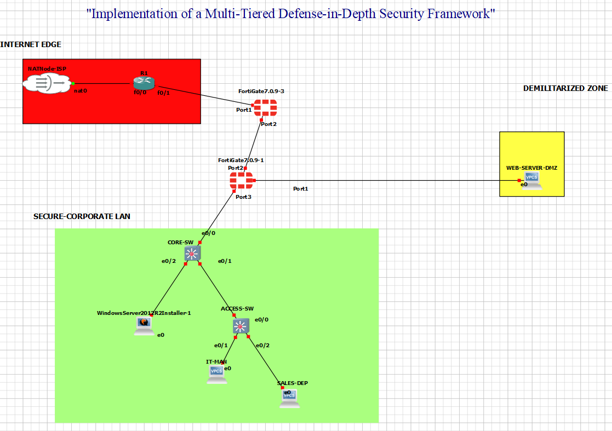

# Multi-Tiered Defense-in-Depth Security Framework 
**Course:** Computer Communication & Networks Lab (Semester 3)
**Environment:** GNS3 (Back-to-Back Firewall Architecture)

##  Network Topology

##  Project Overview
This project addresses the "Perimeter Vulnerability" problem in corporate environments. Instead of relying on a single firewall, this architecture implements a **Back-to-Back Firewall Design** to protect a Windows Server hosting sensitive data. Even if the first layer is breached, the internal assets remain secure.

##  The Layered Defense Strategy
* **Untrusted WAN (Red Zone):** The public-facing edge with a Cisco c3725 Router and NAT gateway.
* **DMZ (Yellow Zone):** A neutral buffer zone hosting the Web Server, allowing external access without risking internal data.
* **Trusted Internal LAN (Green Zone):** The high-security "Vault" containing the Windows Server and departmental users (IT & Sales).

##  Technical Highlights
* **Dual Inspection:** Traffic must pass through both the **Edge FortiGate** and the **Internal FortiGate**.
* **Zero-Trust DMZ:** The internal firewall is configured to block all traffic from the DMZ to the private Windows Server.
* **VLAN Trunking:** Uses 802.1Q encapsulation to isolate the IT and Sales departments.
* **NAT & Static Routing:** Configured to allow secure internet access for internal users while hiding internal IP addresses.

##  Project Files
* **[Perimeter-Vulnerability-Proposal.pdf](./Perimeter-Vulnerability-Proposal.pdf):** Initial security strategy and design.
* **[Perimeter-Vulnerability-Report.pdf](./Perimeter-Vulnerability-Report.pdf):** Final technical implementation and testing results.
* **[Defense-Framework.gns3](./Defense-Framework.gns3):** The GNS3 project file.
