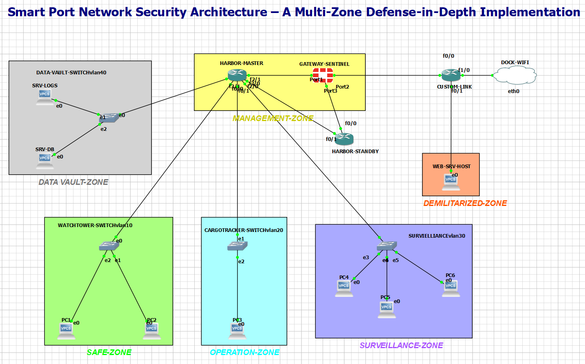

# Smart Port Network Security Architecture 
**Tool:** GNS3 (Integrated with VMware/VirtualBox)

##  Network Topology

##  Project Overview
This project simulates a **Smart Harbor** environment. It uses a **Multi-Zone Defense-in-Depth** strategy to secure administrative, operational, and surveillance data.

##  Security Zones
* **Administrative (VLAN 10):** Harbor-master operations.
* **Operational (VLAN 20):** Cargo tracking and IoT sensors.
* **Surveillance (VLAN 30):** Security camera feeds.
* **DMZ:** Isolated zone for external-facing services.

##  Technical Implementation
* **Firewalling:** Layered security using **FortiGate Firewalls**.
* **Virtualization:** Uses GNS3 VM to run high-performance network nodes.
* **Routing:** Inter-VLAN routing configured on the core router.

##  Project Files
* **[port-report.pdf](./port-report.pdf)**: Technical documentation.
* **[Smart-Port-Project.gns3](./Smart-Port-Project.gns3)**: GNS3 project file.
